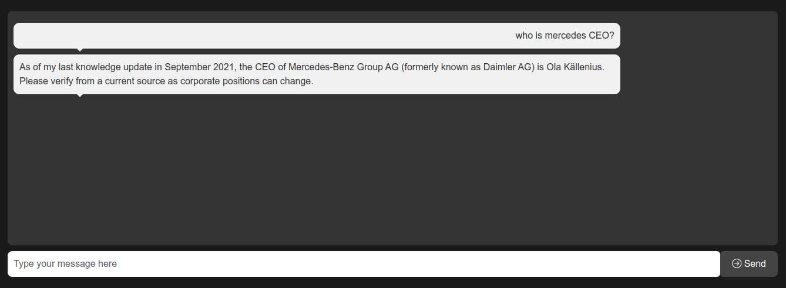

# CUSTOM GPT
###### Updated: 10.07.2024 modules/endpoints

> [!IMPORTANT]
> Please note that this code was further improved from the original version[link](https://github.com/VolkanSah/GPT-Chatbot)

###### GPT is interesting, let's use it to create a better world.

## Prerequisites
-  PHP 7.4 or higher installed on your web server
-  A web server with support for PHP (e.g., Apache or Nginx)
-  Your Unique API KEY FROM [RAPIDAPI](https://rapidapi.com/NextAPI/api/cheapest-gpt-4-turbo-gpt-4-vision-chatgpt-openai-ai-api)

## API Key
- Register for an account or log in to RAPID API Dashboard [HERE](https://rapidapi.com/)
- Inside the marketplace search for **Cheapest GPT-4 Turbo, GPT 4 Vision, ChatGPT OpenAI AI API** by NextAPI.

- Store the API key safely, as you will need it in the next step.

## Setting Up
- Clone or download this repository.
- Replace YOUR_API_KEY in config.php.
- Upload index.html, style.css, script.js, and gptchat.php files to your web server.
- Access index.html in your browser (e.g., https://yourdomain.com/).
- Type a message in the chat input field and press Enter or click the Send button to send the message.
- Using our newly found API, a response will be generated from the GPT-4 model.

## Additional Customization
- The NewsLetter functionality is working, but you can change the receiver address and any other necessary details in subscribe.php file.
- Be cautious when setting limits in the config.php file.
- With PHP files, there's no limit to how a script can be modified.
**please change gptchat.php & config.php to your needs**

## Screenshots

### Special Thanks
**"I personally extend my sincere gratitude to you! Your support is appreciated, and I would be grateful if you could share this project with others, :star: this or any other, or  
[Reach out to me](mailto:john.nzambah@gmail.com). Don't hesistate to reach back for any clarification!"**

### Copyright
- Masaasoft
- [Star on Github](https://github.com/johnnzamba)
- [Developer Site](http://masaasoft.com/gpt/)

### License
This project is copyright © [Masaasoft](https://github.com/johnnzamba) and is licensed under the [MIT LICENSE](LICENSE). You are free to use, modify, and distribute the code and assets, as long as the copyright notice and permission notice are preserved in all copies or substantial portions of the software."

